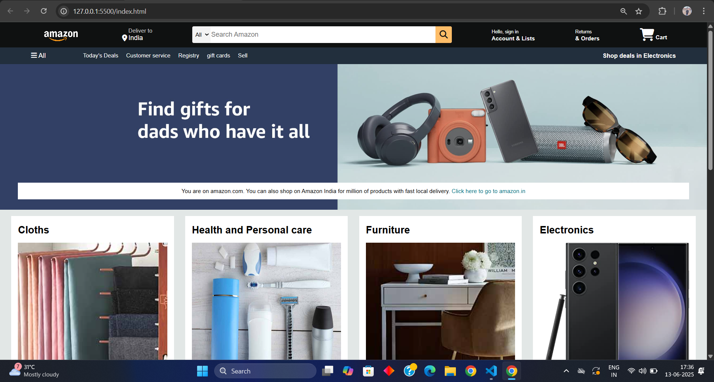

# 🌐 Amazon Clone Web App

This project is a front-end **clone of a popular website**, built using **HTML** and **CSS**. It is intended for learning and practicing front-end web development by replicating the layout, structure, and design of the original site.

---

## 📁 Project Structure

```bash
clone-web-app/
│
├── index.html # Main HTML file
├── style.css # CSS styling
└── assets/ # Images, fonts, etc. (if any)
```
---

## 🚀 Features

- ✅ Clean and semantic HTML structure
- ✅ Fully styled with CSS
- ✅ Responsive layout with media queries
- ✅ Imitates original UI design
- ✅ Easy to read and modify

---

## 🛠️ Technologies Used

- HTML5
- CSS3
- Flexbox & Grid Layout
- Google Fonts (optional)
- Media Queries for responsiveness

---

## 📷 Preview




---

## 📌 How to Use

1. Clone this repository:
   ```bash
   git clone https://github.com/Anjani-189/Amazon-clone.git
2. Navigate to the project folder:

   ```bash
   cd clone-web-app
3. Open index.html in your browser:
- You can double-click the file, or
- Use Live Server (if using VS Code)

## 📚 Learning Purpose
- This project is created only for educational and practice purposes.
- It is not intended for commercial use. All design credits go to the original site.
